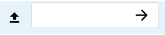
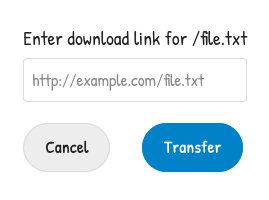

# Nextcloud "Transfer" app

This app allows you to have a file from the Internet transferred directly into
your Nextcloud, without first having to download it to your personal device in
order to upload it. You simply enter the download link and the transfer happens
on the server side, making it possible to leave downloads running in the
background even when your personal computer is switched off.

## Usage instructions

To start a download, select "Transfer file from URL" from the new file menu.

Choose a name to save the file as, and type it into the text box which appears:

Press enter or click the arrow to continue.

Now, you will see a second text box:

Paste the download link for the file here.

Finally, click "Transfer".

## Development information

### Building the app

The app can be built using the provided Makefile by running `make`.
This requires the following programs to be installed:

* `make`
* `which`
* `tar`: for building the archive
* `npm`: for building the JavaScript bundle

### Publishing to the App Store

First get an account for the [App Store](http://apps.nextcloud.com/) then run
`make appstore`. The built archive will be located in `build/artifacts/appstore`
and can then be uploaded to GitHub releases, signed, and uploaded to the App Store.
