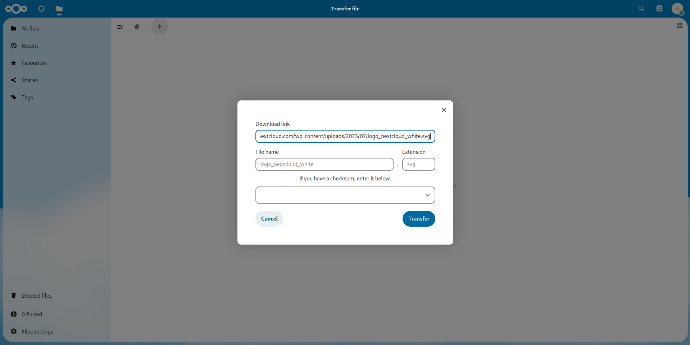
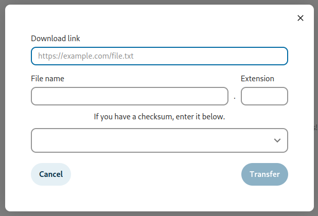

# Nextcloud Transfer app

This app allows you to have a file from the Internet transferred directly into
your Nextcloud, without first having to download it to your personal device in
order to upload it. You simply enter the download link and the transfer happens
on the server side, making it possible to leave downloads running in the
background even when your personal computer is switched off.

## Usage instructions

To start a download, select "Transfer file" from the menu.

A prompt will appear for you to paste the download link. The file name and
extension are filled in automatically when possible, but can be changed.

Once you click "Transfer", the download will be queued to run in the background.
This should start within five minutes if your server is set up correctly.

If you want to reduce this delay, you will need to configure your server to
trigger `cron.php` more often.

## Development information

### Translations

You can help to translate the app by joining the
[Nextcloud team on Transifex](https://www.transifex.com/nextcloud/nextcloud/).

### Building the app

The app can be built using the provided Makefile by running `make`.
This requires the following programs to be installed:

* `make`
* `which`
* `tar`: for building the archive
* `npm`: for building the JavaScript bundle

### Publishing to the App Store

First get an account for the [App Store](http://apps.nextcloud.com/) then run
`make appstore`. The built archive will be located in `build/artifacts/appstore`
and can then be uploaded to GitHub releases, signed, and uploaded to the App Store.
